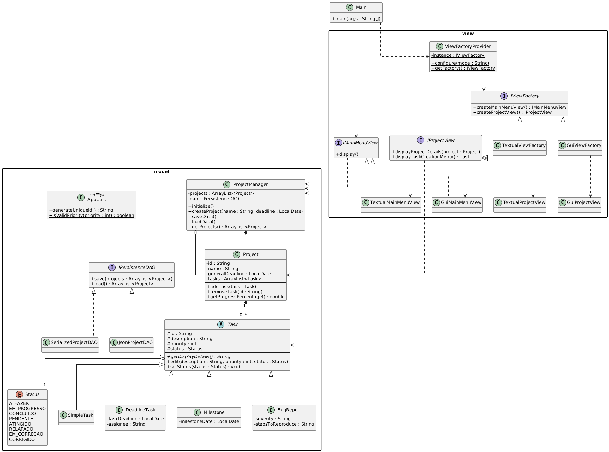

# Gerenciador de Projetos Pessoal

[](https://github.com/Manuelakist/ProjectManager)

Este é um sistema completo de Gerenciamento de Projetos desenvolvido em Java como trabalho final para a disciplina de Programação Orientada a Objetos.

O objetivo principal deste projeto foi construir uma aplicação robusta do zero, demonstrando domínio prático de arquitetura de software, separação de responsabilidades e aplicação correta de múltiplos Padrões de Projeto (Design Patterns).

## O que ele faz?

O sistema permite o gerenciamento completo de múltiplos projetos e suas tarefas:
* **CRUD de Projetos:** Criar, editar, excluir e listar projetos com prazos definidos.
* **CRUD de Tarefas:** Adicionar e gerenciar diferentes tipos de tarefas dentro de cada projeto.
* **Cálculo Automático:** Acompanhamento em tempo real do progresso do projeto (% concluída).
* **Persistência:** Todos os dados são salvos e carregados automaticamente em um arquivo binário (`dados.dat`) usando Serialização Java.
* **Importação de Dados:** Funcionalidade para importar projetos de arquivos externos de backup (`.dat`) através de um seletor de arquivos.

## Arquitetura e Padrões de Projeto

O projeto foi construído seguindo uma arquitetura inspirada no **MVC (Model-View-Controller)**, com uma separação estrita entre a lógica de negócio (`model`) e a interface de usuário (`view`).

Os seguintes Padrões de Projeto foram aplicados:

1.  **Abstract Factory (Fábrica Abstrata)**
    * **Onde:** Pacote `view` (`IViewFactory`, `ViewFactoryProvider`).
    * **Por que:** Permite que o sistema inicie com duas interfaces completamente distintas (**Gráfica/Swing** ou **Textual/Console**) mudando apenas uma linha de configuração no `Main.java`. O sistema não fica acoplado a uma implementação específica de UI.

2.  **Singleton (Único)**
    * **Onde:** `ViewFactoryProvider` (no pacote `view`).
    * **Por que:** Garante que exista apenas uma única instância da fábrica de interface (`IViewFactory`) ativa durante toda a execução do programa. O `Main.java` configura essa instância uma vez, e qualquer parte do sistema pode acessá-la globalmente para criar novas telas, sem precisar passar referências manualmente.

3.  **DAO (Data Access Object) e Strategy**
    * **Onde:** `IPersistenceDAO` e `SerializedProjectDAO`.
    * **Por que:** A interface `IPersistenceDAO` define um contrato (Strategy) para salvar os dados. O `ProjectManager` não sabe *como* os dados são salvos, ele apenas usa a estratégia fornecida. Neste projeto, utilizamos a **Serialização Nativa do Java** (`SerializedProjectDAO`) para persistir o estado completo dos objetos de forma eficiente.

4.  **Factory Method (Fábrica Simples)**
    * **Onde:** `TaskFactory` no pacote `model`.
    * **Por que:** Centraliza a lógica complexa de criação dos diferentes tipos de tarefas (`SimpleTask`, `DeadlineTask`, `Milestone`). O gerenciador apenas solicita uma tarefa do tipo "X" com os dados "Y", sem precisar conhecer os construtores específicos.

5.  **Façade (Fachada)**
    * **Onde:** `ProjectManager`.
    * **Por que:** Esta classe atua como a única porta de entrada para o pacote `model`. A `view` não interage diretamente com listas internas ou DAOs; ela solicita tudo ao "Gerente", que orquestra as operações.

## Cumprimento dos Requisitos Mínimos

Abaixo está o detalhamento de como cada requisito obrigatório da avaliação foi atendido:

* **Pelo menos uma Interface:**
    * Foram utilizadas várias, sendo as principais `IPersistenceDAO` (Persistência) e `IViewFactory` (Fábrica de UI).
* **Pelo menos uma Classe Abstrata:**
    * A classe `Task` é abstrata e define o contrato base para todas as tarefas (id, descrição, status, prioridade).
* **Pelo menos uma Classe Estática:**
    * A classe `AppUtils` é uma classe utilitária estática final (`final`, construtor privado) usada para validações e formatação de dados em todo o sistema.
* **Duas implementações concretas por Interface/Abstrata:**
    * A classe abstrata `Task` possui **3 implementações**: `SimpleTask`, `DeadlineTask` e `Milestone`.
    * A interface `IViewFactory` possui **2 implementações**: `GuiViewFactory` e `TextualViewFactory`.
* **Encapsulamento:**
    * Todos os atributos são `private`. O acesso e modificação são feitos estritamente via Getters e Setters com validação de dados (ex: não permitir datas nulas ou nomes vazios).
* **Herança e Polimorfismo:**
    * O sistema trata todas as tarefas de forma polimórfica. O método `getProgressPercentage()` do Projeto itera sobre uma lista genérica de `Task` sem precisar saber qual é a subclasse específica. A interface também usa polimorfismo para exibir detalhes específicos de cada tarefa na tabela.
* **Manipulação de Arquivos e I/O:**
    * O sistema implementa a leitura de arquivos externos utilizando `JFileChooser` na interface gráfica e entrada de caminho no console, permitindo importar dados de backups localizados fora da pasta do projeto.

## Demonstração do Projeto

O sistema é flexível e pode ser executado em dois modos.

### 1. Interface Gráfica (Swing com FlatLaf)
Utiliza a biblioteca **FlatLaf** (Dark Purple) para oferecer uma experiência visual moderna.

#### Menu Principal (Lista de Projetos)


#### Detalhes do Projeto (Gerenciamento de Tarefas)


---

### 2. Interface Textual (Console)
Uma interface robusta e completa via linha de comando, ideal para ambientes sem suporte gráfico.

#### Menu Principal
O usuário navega através de opções numéricas.
```text
Bem-vindo ao Gerenciador de Projetos!

--- MENU PRINCIPAL ---
1. Listar todos os projetos
2. Criar novo projeto
3. Selecionar um projeto (para ver/add tarefas)
4. Salvar dados agora
5. Editar um projeto
6. Excluir um projeto
7. Importar projetos de arquivo externo
0. Sair
Escolha uma opção: _
```

#### Listagem e Detalhes
A visualização textual também formata os dados (datas, progresso) para facilitar a leitura.

```text
--- Seus Projetos ---
ID: 1 (50%) | Trabalho da Faculdade (Prazo: 01/12/2025)
ID: 2 (0%)  | Reforma do Quarto (Prazo: 15/01/2026)

Digite o ID do projeto que deseja gerenciar: 1

Entrando no projeto: Trabalho da Faculdade...

--- Gerenciando Projeto: Trabalho da Faculdade ---
Progresso: 50% | Prazo: 01/12/2025
----------------------------------------
1. Listar Tarefas
2. Adicionar Tarefa
...
```

---

## Diagrama UML
A estrutura de classes do projeto pode ser visualizada abaixo:


---

## Como Executar

1.  **Pré-requisitos:** Ter o Java (JDK 11 ou superior) instalado.
2.  **Bibliotecas:** O projeto depende da biblioteca `FlatLaf` (para o tema visual). O arquivo `.jar` já está configurado no projeto.
3.  **Executando no IntelliJ:**
    * Abra a pasta do projeto.
    * Execute a classe `src/main/java/Main.java`.
    * Para carregar o projeto com os dados de exemplo, o arquivo `dados.dat` deve estar imediatamente dentro da pasta `data` for executado.
4.  **Alternando entre Texto e Gráfico:**
    * Para mudar a interface, edite o arquivo `src/main/java/Main.java`:
    ```java
    // Para a interface textual: "textual"
    // Para a interface gráfica: "gui"
    ViewFactoryProvider.configure("gui");
    ```
